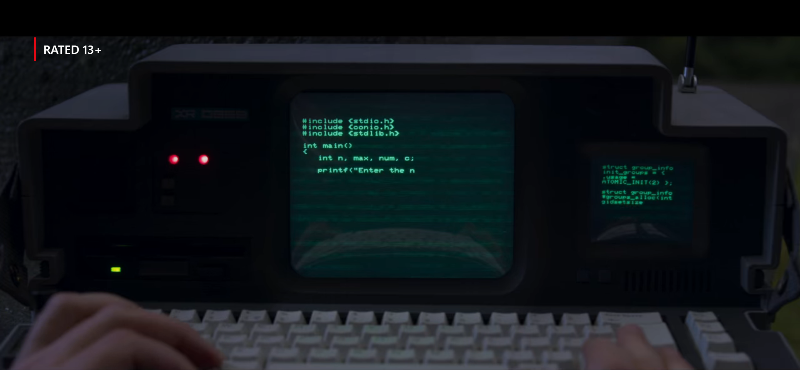
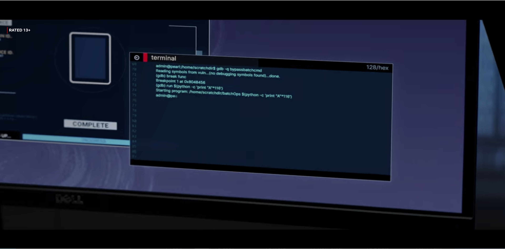
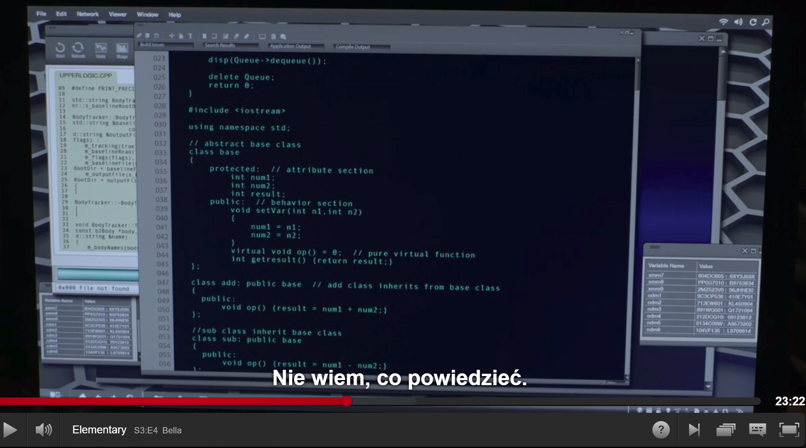
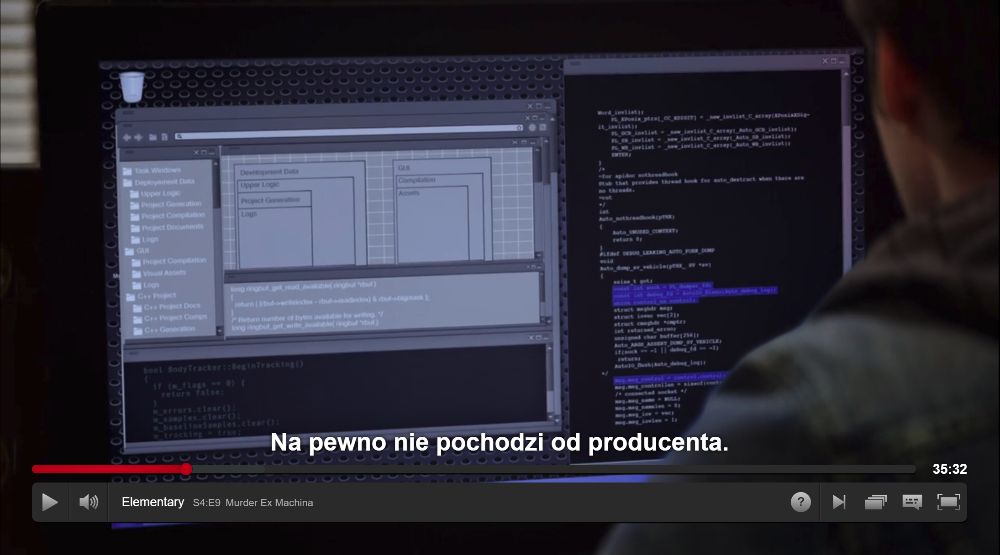
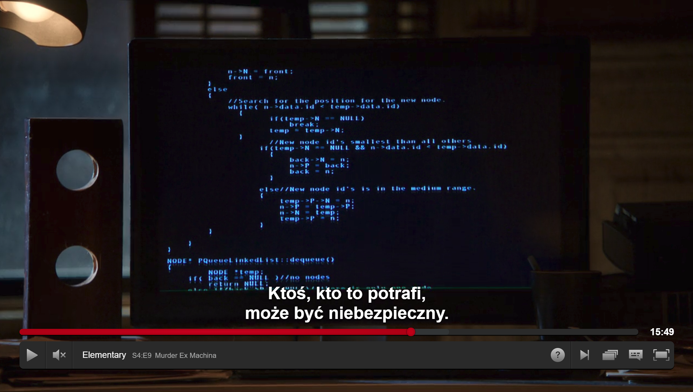
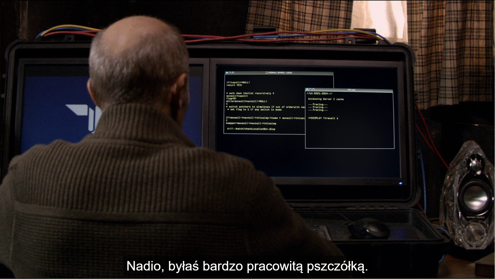

# it-is-not-a-joke
A collection of funny portrays of IT/programming/hacking in movies

## Johnny English Strikes Again
Software for Exo-Skeleton

In the center the software appears to be asking to enter a number.
On the right it appears to be a source code from android kernel - [groups.c](https://android.googlesource.com/kernel/msm/+/android-msm-shiner-3.18-nougat-dr-wear-release/kernel/groups.c#13)

## Skyscraper
Hacking building's control center.

This appears to be a GDB session of a `bypassbatchcmd` program. Setting a breakpoint on `func` (`0x8048456`) and running the program with a payload of 116 letter 'A'.

## Star Trek: Discovery:

### Season 1 episode 3: Context is for Kings
Equations that might be some quantum astrophysics or biochemistry or even gene expression.

This appearst to be a list of Windows exported functions signatures with entries like `FreeLibrary`, `GetFileAttributesExW` and `GetModuleHandleA`.

## Brooklyn Nine-Nine:

### Season 4 episode 22: Crime & Punishment
Back hacking to track money transfer

This appaers to be be Swift programming langauge and an example of using JSON converter into an object.

## Elementary:

### Season 3 episode 4: Bella
Artifficial intelligence named Bella.

The code in the back appears to be a [BodyTracker.cpp](https://github.com/google/liquidfun/blob/master/liquidfun/Box2D/Unittests/BodyTracker.cpp) file from liquidfun project - 2D physics engine.

On the front it appears to be a calculator program written in C++ demonstraiting the OOP concept - inheritance.

### Season 4 episode 9: Murder Ex Machina
Software used in automotive cars

On the bottom it appears to be again the [BodyTrackcer.cpp](https://github.com/google/liquidfun/blob/master/liquidfun/Box2D/Unittests/BodyTracker.cpp#L84C16-L84C16) BeginTracking method.

Code that shows on your screen when your WiFi is tracked.

It appears to be a program that operated on a linked list.

## Psych

### Season 5 episode 9: One, Maybe Two, Ways out
Erasing someone from the "grid".

